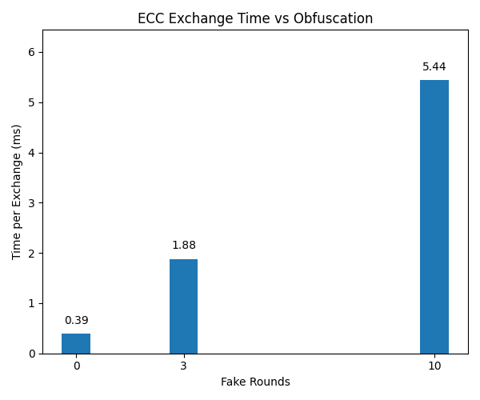

# TransientECC

**Side-channel aware Ephemeral ECDH + AES-GCM encryption with obfuscation and performance trade-off analysis**

TransientECC is a modular C++ cryptographic toolkit built on OpenSSL, designed to explore lightweight countermeasures against side-channel analysis in elliptic curve key exchange. It implements ephemeral ECDH with optional masking, curve rotation, and integrated authenticated encryption (AES-GCM). The project includes microbenchmarking and test coverage, making it suitable for secure communication demos, embedded systems, and cryptographic research.

---

## Key Features

- **Obfuscation Layer**  
  Adds randomized scalar multiplications and dummy operations to mask real elliptic curve computations. Helps reduce the risk of timing attacks and power-based side-channel leakage.

- **Ephemeral ECDH Session Abstraction**  
  Clean class for generating short-lived keypairs and computing shared secrets. Supports real-time use cases without persistent key reuse.

- **Curve Pooling Mechanism**  
  Dynamically rotates between vetted ECC curves (P-256, P-384, P-521) to reduce predictability and enhance key diversity.

- **AES-256-GCM Encryption**  
  Uses the derived ECDH shared secret to produce a 256-bit symmetric key (via SHA-256) for authenticated encryption with AES-GCM.

- **Benchmarking Support**  
  Includes benchmarking scripts to measure the computational overhead of masking at different fake operation levels.

- **Unit Testing**  
  GoogleTest-based coverage for functional and security-relevant components.

---

## Project Structure

```
include/transientecc/    # Public headers
src/                     # Core implementation
tests/                   # Unit tests with GoogleTest
build/                   # CMake output (excluded via .gitignore)
```

---

## Example: Obfuscation vs Performance

The graph below shows ECC key exchange time (ms per round) with increasing fake operation rounds during scalar multiplication.



---

## Build Instructions

```bash
git clone https://github.com/SiddharthaStoic/transientecc.git
cd transientecc
mkdir build && cd build
cmake .. -DBUILD_TESTING=ON
cmake --build .
./aes_demo        # ECDH + AES-GCM encryption
./ecdh_demo       # ECDH with ephemeral keys
./benchmark       # Performance of masking
```

Requires:  
- OpenSSL (≥ 1.1)  
- CMake (≥ 3.10)  
- GCC or Clang with C++17 support

---

## Use Case Scenarios

- **Cryptographic R&D**: Analyze masking effectiveness in ECC-based protocols
- **Secure Communication Prototypes**: Build E2E encryption layers with ephemeral key exchange
- **Educational Tools**: Demonstrate practical implications of side-channel countermeasures
- **IoT/Embedded Systems**: Balance lightweight ECC with configurable masking

---

## Novelty and Contributions

1. **Blinded Scalar Multiplication Engine**  
   Implements randomized decoy EC multiplications with configurable rounds, integrated into the key exchange process.

2. **Modular ECDH Session Layer**  
   Provides clean abstractions for ephemeral keypair management, decoupled from raw OpenSSL usage.

3. **Benchmark-Driven Design**  
   Performance impact of masking is explicitly measured, helping users tune their security-performance tradeoff.

4. **Curve Pooling Strategy**  
   Supports dynamic curve selection to avoid fixed-curve key schedules and increase entropy surface.

Unlike standard ECDH demos, TransientECC places emphasis on integration of masking techniques with real encryption and benchmarking to reflect realistic constraints in secure systems.

---

## License

MIT License

---

## Author

[Siddhartha Mahesha Pundit](https://github.com/SiddharthaStoic)